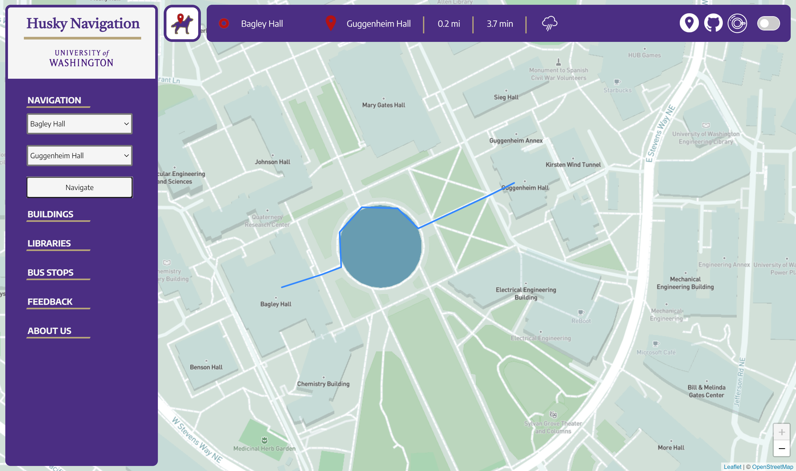

# Husky-Navigation
A full-stack web application for navigation of the University of Washington Campus that enables shortest-route calculation between buildings and other locations. Builds off the existing, limited [University of Washington Campus Map web application](https://www.washington.edu/maps/) in a campus-oriented way. Built to be highly scalable such that other campuses can customize our map for the University of Washington Campus for their own campus.

# Detailed Walk-through

The primary goal of this project is to enable campus-oriented and intuitive navigation of the University of Washington campus. On the left sidebar, the first dropdown is for navigation (i.e., calculating the shortest path from two locations). To navigate between two locations, choose your "Starting Point" in the top selection, the "Destination" in the bottom selection, and click the “Navigate” button. One can also select locations by hovering over them and clicking on them. If the selections are invalid, an alert will appear asking you to try again and the navigation request will fail. 

The next three dropdowns enable you to easily search for UW locations, and, when clicked, locate them on the full-screen map. In the fifth dropdown, there is an option to send feedback to the developers through SMTP servers. The final dropdown describes the developers briefly. The left sidebar can be entirely collapsed (and reopened) by clicking the website logo immediately to the right of the sidebar to get a better view of the map.

On the horizontal bar, the starting point and destination selected in the left sidebar are listed first. Following is the total distance along the recommended path from these locations in miles, and the estimated time of arrival in minutes. Next is a weather icon which shows the current weather in Seattle, WA using the OpenWeatherMaps API. If you click the icon, a popup will drop down from the icon with more details about the icon itself, the current temperature in two units, the windspeed, and another icon recommending whether or not to bring an umbrella. If the icon is clicked again, the popup will close. 

To the right of the weather icon is an option to display your current location using a browser API. If the user is outside the University of Washington campus, an alert will appear stating that the website is best-suited for navigation within the campus, and has limited functionality beyond it. The next icon, the GitHub logo, takes you to our public GitHub repository when clicked. The coffee-cup icon (which is currently not a released feature) gives the user an option to “buy us a coffee,” or donate money to our website’s further development. Finally, the right-most switch on the horizontal bar changes the theme of the entire webpage to an alternate dark-mode theme.

# Accesing the application

All a user needs to do in order to interact with all the content of the Husky Navigation web application is to go to:

[https://huskynavigation.azurewebsites.net](https://huskynavigation.azurewebsites.net)

Through this website the user can engage with most of the features mentioned in the previous section and use the navigation feature while our team continues to rapidly expand the supported regions of the University of Washington campus (meaning that some paths may be unavailable).

Thank you and we hope you enjoy!

Video Guide Walkthrough:

[https://youtu.be/ExndwEhgLXs](https://youtu.be/ExndwEhgLXs)
